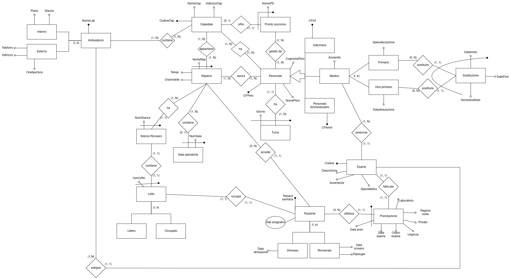
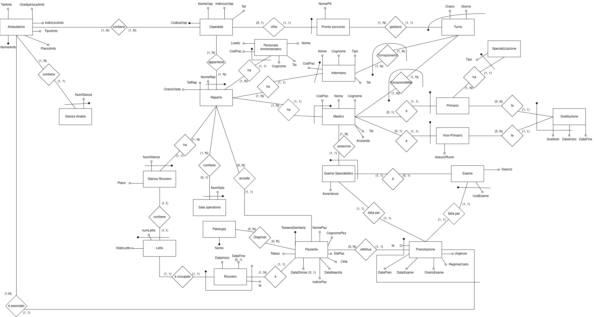
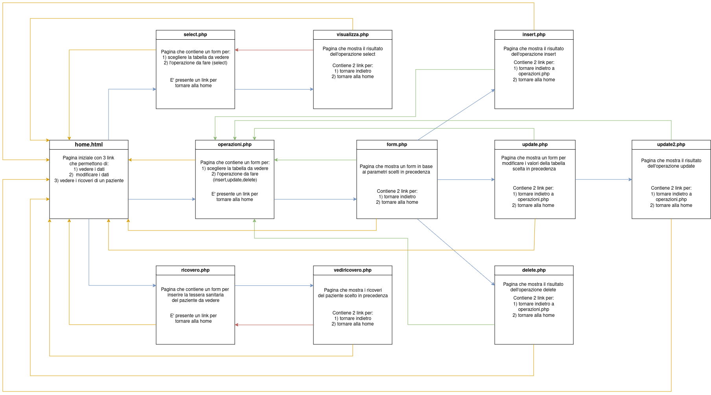

# Gestione Aziende Ospedaliere
Progetto realizzato per il corso di Basi di Dati e Web (a.a. /2023/24).

# Descrizione
Applicazione web per la gestione semplificata di un insieme di aziende ospedaliere di una regione: reparti, personale (medici, infermieri, personale amministrativo), pazienti, ricoveri, laboratori/ambulatori, esami e prenotazioni.

# Tecnologie utilizzate
- **XAMPP**, ambiente locale per l'esecuzione del sito (Apache), accessibile tramite localhost
- **PHP**, logica applicativa lato server
- **PostgreSQL**, sistema di gestione della base di dati
- **pgAdmin**, strumento per l'amministrazione e la gestione del database PostgreSQL

# Sito web
La navigazione del sito è basata su una struttura a link: partendo dalla home page, ogni collegamento porta alla relativa sezione dell'applicativo. La grafica è minimale, poiché l'obiettivo del progetto è la gestione della base di dati piuttosto che la cura dell'aspetto visivo.
- 

# Schemi
- Schema ER1
  
- Schema ER2
  
- Schema di Navigazione del sito
  

# Documentazione
- [Specifica del progetto](Docs/progetto2023-2024.pdf)
- [Documentazione completa](Docs/DocUfficiale.pdf)
